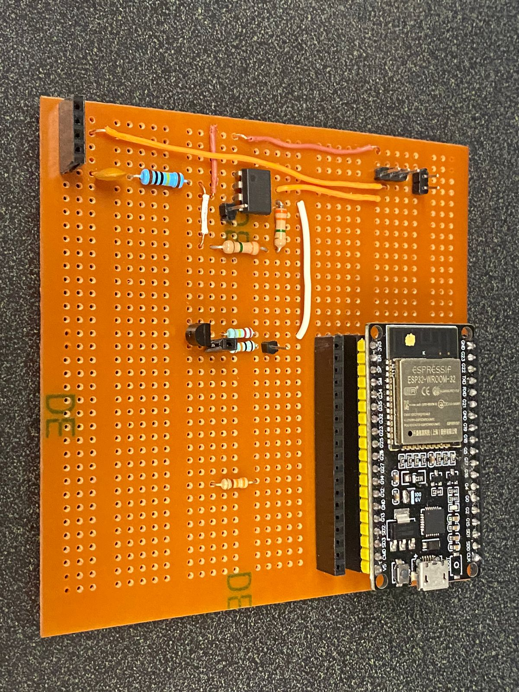

# Sistemas-Ciberfisicos-II
## Autores
Este proyecto fue desarrollado por:
- Abril Berenice Bautista Román
- Luis Eduardo Ávila Gómez
- Mariel Alquisira Morales
- Nancy L. García Jiménez

## Acerca
Este repositorio contiene el código fuente, los esquemáticos de conexión, los modleos CAD en formato de edición de fusion y tipo objeto necesarios para el desarrollo de 3 propuestas para una futura implementación en la fábrica de tornillos Forjadora Panamericana, S.A. De C.V.
- En la maquina ranuradora, se implementó un prototipo para la detección del estado del herramental usado para el grabado de la figura del cabezal de los tornillos, esto utilizando un clasificador de red neuronal convolucional de 2 clases.
- En la maquina forjadora se implementó un sistema de cómputo en la nube que incluye una interfaz en línea de un contador de los tornillos producidos y una alarma de detección de atasco.
- Finalmente utilizando las medidas reales de la roladora se modeló un gemelo digital utilizado en una propuesta de realidad virtual y otra de realidad aumentada.

## Hardware usado
Para el primero proyecto se utilizó:
- Como microcontrolador un arduino uno.
- Como actuador un servo motor con tope de 180.
- Un sistema de biela manivela cortada en mdf y otras partes impresas en 3D. 
- Cámara Raspberry Pi para la parte de visión computacional.

En el segundo proyecto se diseñó el siguiente circuito para el acondicionamiento de señal

### Libraries
For the Mega, is important having the library used for the FreeRTOS implementation:
- FreeRTOS (*It can be downloaded from the library administrator from the Arduino IDE.*)

For the NodeMCU, since it works with the Arduino IoT Cloud, is a must having the following library, also available in the IDE library administrator:
- ArduinoIoTCloud (*install dependencies also [Arduino ConnectionHandler library]*)

For both microcontrollers, Mega and NodeMCU, is important the use of the following CAN library, since is the only one compatible with the model of Node used in this implementation (Esp8266).
- Arduino MCP2515 (https://github.com/autowp/arduino-mcp2515)

**Note:** *Make sure to have the libraries in the correct libraries path in order to make it work and prevent errors.*

### Qué códigos usar
Para el microcontrolador conectado al prototipo del primer proyecto ir a la carpeta **computo_cognitivo**, usar el codigo **servo_180.ino**.
Para la implementación del dashboard en Home Assistant usar:
- **ArduinoMega2560_OneServo** if you will only use 1 continuous servomotor
- **ArduinoMega2560_TwoServo** if you will use both servomotors

## Esquematicos
In the following pictures, it's visible how the connections were made.

Using 2 servomotors:

Using 1 servomotor:

## Arduino IoT Cloud Connection
For the reference on how to connect the NodeMCU to the IoT Cloud, please refer to the following tutorial from Arduino: https://docs.arduino.cc/cloud/iot-cloud/tutorials/esp-32-cloud

**Note**: *Make sure to **NOT** modify the name generated in the paltform for the device, until this day (01/12/2021) changing the name generates error connections.*
